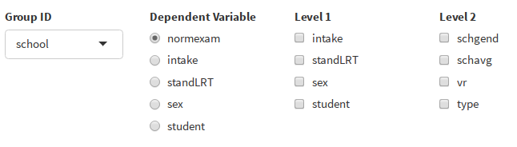
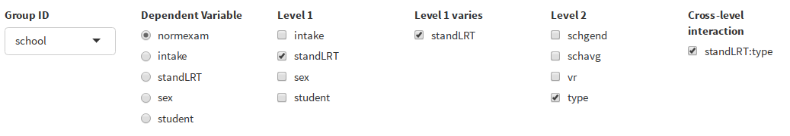

```{r, include = FALSE}
knitr::opts_chunk$set(
  collapse = TRUE,
  comment = "#>",
  fig.path = "man/figures/README-",
  out.width = "100%"
  
)
```

# mimosa

[](https://travis-ci.org/johannes-titz/mimosa)

The mixed models special agent (``mimosa``) is a ``shiny`` [@chang2019] app for 2-level mixed models. Mixed models are rapidly becoming the gold standard of statistical analysis techniques in the behavioral sciences. At the same time there exist few user-friendly software to conduct mixed model analyses. The most common tools often lack a graphical user interface, are proprietary, and involve a tedious process of getting data in and publication-ready tables out. The shiny app ``mimosa`` is supposed to offer an alternative that is free, open source, intuitive, and runs in a browser, making it easily accessible (see https://www.mimosa.icu).

The software is targeted at behavioral scientists who frequently use 2-level mixed models and want a tailored solution for this specific use case. For instance, researchers studying groups (e.g. students clustered in schools, individuals clustered in work groups) and researchers employing within-subjects designs almost exclusively analyze their data with 2-level mixed models. In contrast to other software, ``mimosa`` was designed for this use case. It helps the analyst by automatically detecting potential grouping variables and categorizing variables in level 1 and level 2. Furthermore, ``mimosa`` is researcher-oriented because it produces a single summary table via ``sjPlot`` [@ludecke2018] that can be published in a scientific journal without any modifications.

These benefits come at the cost of the limitation to 2-level models. If you need to model more complex cases, ``mimosa`` might not be suited for you and you should check out the more comprehensive software ``GAMLj`` [@gallucci2020].

## Installation
No need to install mimosa, just go to www.mimosa.icu and use it there. An example data file is loaded when you go to www.mimosa.icu/example.

If you really want to use it locally, install from github (you need the package devtools for this):

```{r echo = T, results = "hide", eval = F}
devtools::install_github("johannes-titz/mimosa")
```

And now run the app:

```{r echo = T, results = "hide", eval = F}
mimosa::run_app()
```

Yes, it is that easy---at least under GNU/Linux! 

If you have any problems installing mimosa, check that your R version is up to date (currently 3.6.2). If you are using Windows, enable TLS 1.2 in the Internet Options Advanced tab (see https://github.com/r-lib/remotes/issues/130#issuecomment-423830669). Under Windows, you will also need Rtools to build the package: https://cran.r-project.org/bin/windows/Rtools/.

If it still does not work drop me an e-mail at johannes at titz.science or at johannes.titz at gmail.com.

## Using mimosa
As an example data set we will use exam scores of 4,059 students from 65 schools in Inner London [@goldstein1993], which is available in the R package ``mlmRev`` [@bates2019]. The variables are described in the table below. Here, we will focus on the exam score as the outcome variable and use LRT and school type as a predictor. The standardized exam score is a total score of different subjects taken in a public examination at age 16. LRT is the London Reading Test, taken at the age of 11. Both variables are already $z$-standardized in the data set. The other variables are described in more detail in @goldstein1993 and @nuttall1989.

  variable   description                                                data type   levels (if factor)
  ---------- ---------------------------------------------------------- ----------- ------------------------------
  school     school ID                                                  factor      65 levels
  normexam   standardized exam score                                    numeric     
  schgend    school gender                                              factor      mixed, boys, girls
  schavg     school average of intake score                             numeric     
  vr         student level Verbal Reasoning (VR) score band at intake   factor      bottom 25%, mid 50%, top 25%
  intake     band of student's intake score                             factor      bottom 25%, mid 50%, top 25%
  standLRT   standardized listening and reading test score              numeric     
  sex        sex of the student                                         factor      F, M
  type       school type                                                factor      Mxd, Sngl
  student    student ID (within school)                                 factor      650 levels

  : []{#tab:data label="tab:data"} Description of example data. *Note*. This data is available in the R package ``mlmRev`` [@bates2019] and is from the study by @goldstein1993.

If you want to follow the example you can now go to [www.mimosa.icu/example](www.mimosa.icu/example), which will automatically load the school data set. A big improvement over existing software is that mimosa detects the grouping variable and the hierarchical levels in the data automatically when the data is loaded:



In the school data set, *school* is indeed the grouping variable. The automatic selection process works by analyzing the structure of the data. For every potential grouping variable, mimosa checks how many level-2 variables would be created and how many different levels exist on average. Based on this, many variables can be excluded as grouping variables and the remaining ones can be ordered by the likelihood of being the correct grouping variable. This heuristic works suprisingly well. It has been tested with a dozen of real data files that have a 2-level structure and mimosa was always able to guess the correct grouping variable. Even if the heuristic should fail, one can select the correct grouping variable manually.

If the grouping variable is known, the procedure to categorize variables in level 1 and level 2 is as follows: Take a variable and group it by the grouping variable. Then, determine the number of unique levels of the variable (for each group). If the variable is on the second level, the number of unique levels should be one for each group. As an example, consider the school data set. It has 65 schools and a variable on the second level is *schgend*, the school gender (mixed, boys, girls). For every school, the school gender is constant, so this is a level-2 variable.

Model specification is quite self-explanatory: First one determines the dependent variable, for which the exam score (*normexam*) appears most interesting in the school data set (see image above). The output for this null model is directly created with the most useful statistics:


The null model produces an intercept of close to 0, which makes sense since the data is standardized. The output table is created with ``sjPlot`` [@ludecke2018]. It is concise, nicely formatted and can be either downloaded as an HTML file or directly copy-pasted to the application of choice (e.g. a word processor). Additional statistics (standard error, AIC, deviance, Log-Likelihood, standardized coefficients, test statistic, $p$-value), can be selected in the Table Options dialog (not shown here).

The model description is shown mathematically and in R syntax of the ``lme4`` package:


In the next step one can select the independent variables on level 1, after which one can further specify if these variables should be modeled as random or fixed effects. For the example data set, one can add *standLRT* (a standardized listening and reading test score). The output table as well as the model description adapts each time a change is made. Note that, to avoid redundancy, this updated table is not shown here, but you can check the results on your own at [www.mimosa.icu/example](www.mimosa.icu/example). The effect for *standLRT* is .56. One can add a random component to the effect, which will result in an estimate for the variance in the population of the *standLRT* effect $\tau_\mathrm{11 school.standLRT}$ (not shown here). It is only 0.01, but the square root $\sqrt{0.01}=.1$ is usually more interesting, giving the estimated population standard deviation for the estimated population effect of .56.

In the following step, one can add a variable on level 2, for instance *type*. The resulting model shows that, compared to mixed schools, single schools perform somewhat better (not displayed here). If at least one level-1 variable varies and a level-2 variable is selected, cross-level interactions can also be specified. If the level-1 variable does not vary, this option is not available because the idea of an interaction is that one can predict the size of an effect on level 1 by using a level-2 variable. In the exemplary analysis, only one interaction is available, between *standLRT* and *type*. By selecting it we arrive at the final model:




The effect of the interaction is about -0.03, meaning that the relationship between *standLRT* and *normexam* is a bit lower for single gender schools than for mixed gender schools. But the effect is not reliable since the confidence intervals are quite wide.

The general conclusion for the data set might be that a reading test at age 11 can predict the final exam grade at age 16 relatively well. Furthermore, single gender schools perform somewhat better than mixed gender schools. Overall, the model explains about 43% of the total variance, which is quite good for social science.

## Issues and Support
If you find any bugs, please use the issue tracker at:

https://github.com/johannes-titz/mimosa/issues

If you need answers on how to use the package, drop me an e-mail at johannes at titz.science or johannes.titz at gmail.com

## Contributing
Comments and feedback of any kind are very welcome! I will thoroughly consider every suggestion on how to improve the code, the documentation, and the presented examples. Even minor things, such as suggestions for better wording or improving grammar in any part of the package, are more than welcome.

If you want to make a pull request, please check that you can still build the package without any errors, warnings, or notes. Overall, simply stick to the R packages book: https://r-pkgs.org/ and follow the code style described here: http://r-pkgs.had.co.nz/r.html#style

## References
